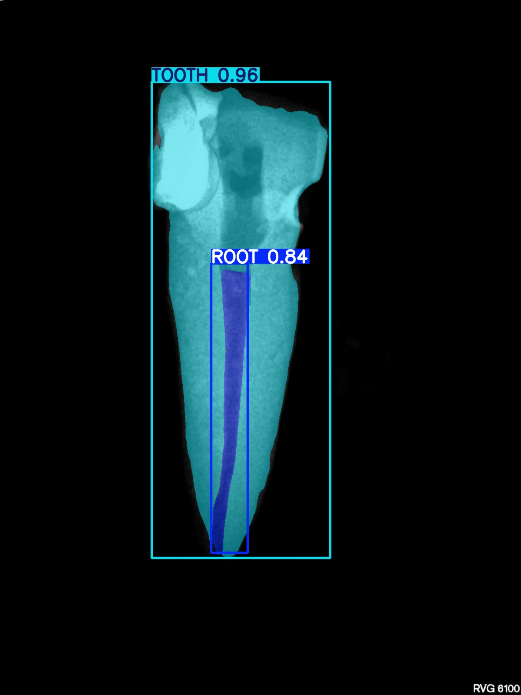
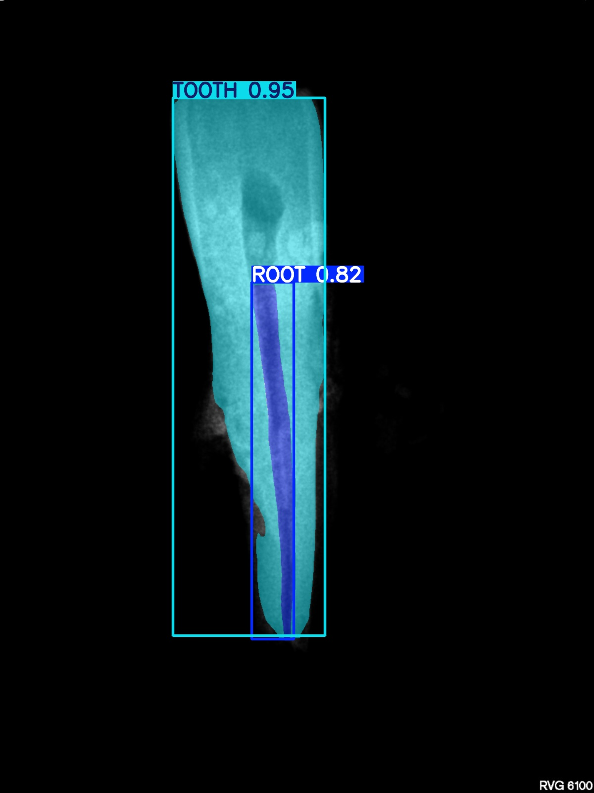

# Segmentación Automatizada de Nervios y Dientes en Radiografías Dentales


**Autor**: Urko Alli Barrena.

**Tutores**: Pedro Latorre Carmona y José Francisco Diez Pastor.

---

En este repositorio se encuentran todos los recursos necesarios del Trabajo de Fin de Grado titulado **"Segmentación automatizada de nervios y dientes en radiografías dentales. Y estimación de la longitud del nervio."**, el cual ha sido desarrollado por **Urko Alli Barrena** en la Universidad de Burgos, en el grado de Ingeniería de la Salud. El objetivo principal de este proyecto envuelve la utilización de técnicas de aprendizaje profundo para llevar a cabo la segmentación automática del canal radicular y diente a partir de radiografías dentales, para lograr la estimación de la longitud del nervio (canal radicular) de manera precisa y fiable.

---

## Índice

1. [Descripción del Proyecto](#descripción-del-proyecto)
2. [Características Principales](#características-principales)
3. [Estructura del Repositorio](#estructura-del-repositorio)
4. [Procedimiento](#procedimiento)
5. [Resultados](#resultados)
6. [Aplicación](#aplicación)
7. [Futuras Líneas de Trabajo](#futuras-líneas-de-trabajo)

---

## Descripción del Proyecto

Las técnicas tradicionales endodónticas, llevan a cabo la medición de la longitud del canal radicular presente en un diente de manera manual, normalmente mediante varillas que una vez introducidas en el conducto del nervio, se sacan y se miden. También existen otras técnicas, como son los localizadores apicales. Estos, son un tipo de dispositivos eléctricos los cuales suelen implicar error de cálculo, una intervención más larga y asimismo, una exposición mayor del paciente ante radiación electromagnética (Rayos-X).

En consecuencia, este proyecto viaja de la mano del _Deep Learning_ con el objetivo de reducir al máximo el número de citas clínicas, favoreciendo así un mejor flujo en el sector odontológico, además de, minimizar la exposición del paciente ante radicación y facilitar o ayudar al odontólogo en tareas endodónticas.

Cabe destacar, que para la implementación de este proyecto se ha hecho uso del modelo _YOLOv11n-seg_ que proporciona _Ultralytics_, para llevar a cabo la segmentación automática de los canales radiculares y dientes presentes en radiografías dentales.

---

## Características Principales

* **Segmentación automática** de nervios y dientes en radiografías mediante el modelo YOLOv11n-seg.
* **Preprocesamiento**: normalización de coordenadas, detección y corrección de datos erróneos...
* **Validación cruzada**: implementada con 5 _folds_ para lograr una mayor robustez y generalización del modelo.
* **Métricas**: Precisión, Recall, IoU (Intersection over Union), F1‐Score y mAP50‐95 (esta última para escoger el mejor modelo entrenado).
* **Aplicación**: aplicación ejecutable encargada de cargar una radiografía dental y ejecutar internamente un proceso de predicción, mediante el cual se obtendrá la máscara predicha del canal radicular presente en el diente de la radiografía dental y a partir de la cual se obtendrá su esqueleto con el objetivo de estimar la longitud del canal radicular del nervio. Además incluye una interfaz interactiva y fluida, mediante paneles (muestran imágenes) y con la posibilidad de almacenar los resultados.

---

## Estructura del Repositorio

```
├── README.md
├── app
│   └── README_APP.txt
├── codigo
│   ├── APLICACION.py
│   ├── REALIZAR_PREDICCION.py
│   ├── confirmarCoordenadas.py
│   ├── entrenamientoModelo.py
│   ├── metricasBoundingBoxes.py
│   ├── obtenerDatasetCompleto.py
│   ├── obtenerDimensionesImagenes.py
│   ├── obtenerMetricasPredicciones.py
│   └── validacionCruzada.py
├── resultados
│   ├── error_predicciones.xlsx
│   ├── metricas_canalradicular.xlsx
│   └── metricas_diente.xlsx
├── .gitignore
└── requerimientos.txt
```

---


## Procedimiento

1. Obtención, preprocesamiento y validación del conjunto de datos.
2. Implementación de la validación cruzada (5 _folds_)
3. Entrenamiento y validación del modelo.
4. Análisis de resultados de entrenamiento.
5. Predicciones.
6. Análisis de resultados y métricas de predicciones
7. Desarrollo de aplicación (_APP_).

---

## Resultados
A continuación se muestran varios resultados de segmentación de canal radicular y diente, donde las máscaras segmentadas han sido predichas por el modelo previamente entrenado.

<p align="center">
  
  &nbsp;&nbsp;&nbsp;&nbsp;&nbsp;&nbsp;
  
</p>

<p align="center">
  <em>En azul oscuro la máscara predicha del canal radicular, y en azul más claro la máscara predicha del diente.</em>
</p>


## Aplicación
En esta sección se muestra un ejemplo de la iniciación de la aplicación, y seguidamente un ejecución de la misma con el objetivo de estimar la longitud sobre una radiografía dental.


<p align="center">
  <em>Pantalla de inicio de la aplicación antes de realizarse cualquier proceso.</em>
</p>


<p align="center">
  <em>Ejemplo de ejecución de predicción para la estimación de la longitud del canal radicular sobre una radiografía dental</em>
</p>


## Futuras Líneas de Trabajo

Tras llevar a cabo la implementación y el desarrollo completo del proyecto, surgen algunas cuestiones las cuales serían de gran interés su aplicación en trabajos futuros. Las líneas de trabajo futuras más interesantes a desarrollar son:

1. Amplicación del conjunto de datos con el objetivo de lograr una mejor generalalización del modelo.
2. Considerar la aplicación de otros modelos, arquitecturas, o incluso la implementación híbrida.
3. Integración de la aplicación de manera directa en un aparato clínico.
